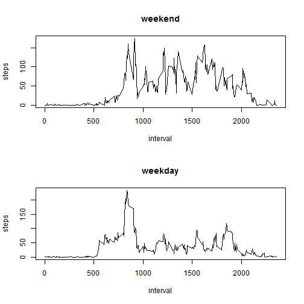

# Reproducible Research: Peer Assessment 1
by Max Ehrlich

The data for this assignment can be downloaded from the course web site:

Dataset: Activity monitoring data [52K]
The variables included in this dataset are:

steps: Number of steps taking in a 5-minute interval (missing values are coded as NA)

date: The date on which the measurement was taken in YYYY-MM-DD format

interval: Identifier for the 5-minute interval in which measurement was taken

The dataset is stored in a comma-separated-value (CSV) file and there are a total of 17,568 observations in this dataset.

## Loading and preprocessing the data

R-Code for reading and preparing data:


```r
library(ggplot2)  # package for plots

# download, unzip and read the data
download.file("https://d396qusza40orc.cloudfront.net/repdata%2Fdata%2Factivity.zip",
              destfile = "activity.zip")
```

```
## Error: unsupported URL scheme
```

```r
unzip("activity.zip")
activity <- read.csv("activity.csv")
#formatting data
activity$date <- as.Date(activity$date, format = "%Y-%m-%d")
```


## What is mean total number of steps taken per day?
For this part of the assignment, you can ignore the missing values in the dataset.

* Make a histogram of the total number of steps taken each day


```r
histogramdata <- aggregate(steps ~ date, data = activity, FUN = sum)
qplot(date, steps,	data	=	histogramdata, geom="bar", stat="identity")
```

 


* Calculate and report the mean and median total number of steps taken per day

mean:

```r
calculated_mean <- mean(histogramdata$steps)
print(calculated_mean)
```

```
## [1] 10766
```
median:

```r
calculated_median <- median(histogramdata$steps)
print(calculated_median)
```

```
## [1] 10765
```

## What is the average daily activity pattern?
* Make a time series plot (i.e. type = "l") of the 5-minute interval (x-axis) and the average number of steps taken, averaged across all days (y-axis)

```r
linedata <- aggregate(steps ~ interval, data = activity, FUN = mean)
max_interval <- linedata[which.max(linedata$steps), 
    ]$interval
ggplot(linedata, aes(x=interval, y=steps))+ geom_line()+
  geom_point(aes(x = max_interval, y = max(linedata$steps), color = "red"))+
  scale_color_manual(name="",labels="Maximum Activity", values="red")
```

 

* Which 5-minute interval, on average across all the days in the dataset, contains the maximum number of steps?

```r
print(c(paste("Interval with Maximum Activity: ", max_interval)))
```

```
## [1] "Interval with Maximum Activity:  835"
```


## Imputing missing values
Note that there are a number of days/intervals where there are missing values (coded as NA). The presence of missing days may introduce bias into some calculations or summaries of the data.

Calculate and report the total number of missing values in the dataset (i.e. the total number of rows with NAs)


```r
sum(is.na(activity))
```

```
## [1] 2304
```

Devise a strategy for filling in all of the missing values in the dataset. The strategy does not need to be sophisticated. For example, you could use the mean/median for that day, or the mean for that 5-minute interval, etc.

* I will take the mean per interval!

Create a new dataset that is equal to the original dataset but with the missing data filled in.


```r
nas <- is.na(activity$steps)
activity$steps_filled<-activity$steps
activity$steps_mean<-merge(x=activity,y=linedata,by="interval")$steps.y
activity$steps_filled[nas]<-activity$steps_mean[nas]
```


Make a histogram of the total number of steps taken each day and Calculate and report the mean and median total number of steps taken per day. 


```r
histogramdata <- aggregate(steps_filled ~ date, data = activity, FUN = sum)
qplot(date, steps_filled,  data	=	histogramdata, geom="bar", stat="identity")
```

 

mean:

```r
calculated_mean <- mean(histogramdata$steps_filled)
print(calculated_mean)
```

```
## [1] 10890
```
median:

```r
calculated_median <- median(histogramdata$steps_filled)
print(calculated_median)
```

```
## [1] 11015
```

Do these values differ from the estimates from the first part of the assignment? What is the impact of imputing missing data on the estimates of the total daily number of steps?

* Yes, it does! The average and median gets bigger!

## Are there differences in activity patterns between weekdays and weekends?

For this part the weekdays() function may be of some help here. Use the dataset with the filled-in missing values for this part.

Create a new factor variable in the dataset with two levels - "weekday" and "weekend" indicating whether a given date is a weekday or weekend day.


```r
weekend <- function(date) {
    if (weekdays(as.Date(date)) %in% c("Samstag", "Sonntag")) {
        "weekend"
    } else {
        "weekday"
    }
}

activity$weekend <- as.factor(sapply(activity$date, weekend))
```

Make a panel plot containing a time series plot (i.e. type = "l") of the 5-minute interval (x-axis) and the average number of steps taken, averaged across all weekday days or weekend days (y-axis). 


```r
par(mfrow = c(2, 1))
for (type in c("weekend", "weekday")) {
    steps.type <- aggregate(steps ~ interval, data = activity, subset = activity$weekend == 
        type, FUN = mean)
    plot(steps.type, type = "l", main = type)
}
```

 
